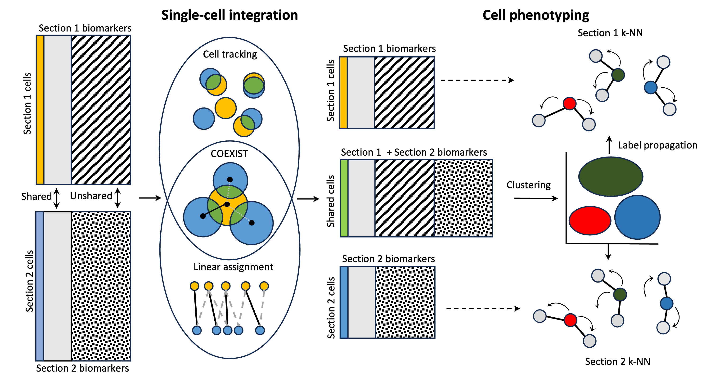

# COEXIST: Coordinated single-cell integration of serial multiplexed tissue images

## Description

Multiplexed tissue imaging (MTI) and other spatial profiling technologies commonly utilize serial tissue sections to comprehensively profile a tissue sample by combining unique biomarker panels or assays. The dependence on serial sections is attributed to technological limitations of MTI panel size or incompatible multi-assay protocols. Although image registration can align serial MTIs, integrating them at the single-cell level poses a challenge due to inherent biological heterogeneity. Existing computational methods overlook cell population heterogeneity across modalities and spatial information, which is critical for effectively completing this task. To address this problem, we first utilize Monte-Carlo simulations to estimate the overlap between serial 5μm-thick sections. We then introduce COEXIST, a novel algorithm that synergistically combines shared molecular profiles with spatial information to seamlessly integrate serial sections at the single-cell level. We demonstrate its necessity and performance across several applications, including combining MTI panels and comparing MTI platforms at single-cell resolution. COEXIST not only overcomes the limitation of MTI’s panel size but also elevates MTI platform validation to an unprecedented level of resolution. 



## Installation
```
git clone https://github.com/heussner/coexist.git
conda create -n coexist -c conda-forge python=3.9 jupyter scikit-image scikit-learn tifffile pandas tqdm matplotlib
conda activate coexist
```

## Usage

Simple matching demonstration:
```
# import package
import coexist

# instantiate model
model = coexist.model.COEXIST(im1_mask=slide_1_mask, # registered serial section image masks
                              im2_mask=slide_2_mask,
                              df1 = slide_1_table, # corresponding cell-feature DataFrames
                              df2 = slide_2_table,
                              cellID_key = 'CellID', # key in DataFrames that maps to cell label/ID
                              shared_markers=shared_dict, # dict of shared features 'key1':'key2'
                             )

# process input data
model.preprocess_data()

# perform matching with COEXIST
model.match_cells()

# check the resulting shared marker correlations
model.check_correlations()

# get matching
model.match_book

# get 1:1 matched tables
model.df1_matched
model.df2_matched
```

To see Jupyter Notebook examples of spatial profiling or MTI platform comparison with COEXIST, visit ```/examples```

## Acknowledgements

This work was supported by the National Institutes of Health (R01 CA253860). YHC acknowledges funding from the National Institute of Health (U2CCA233280) and Kuni Foundation Imagination Grants. The resources of the Exacloud high-performance computing environment developed jointly by OHSU and Intel and the technical support of the OHSU Advanced Computing Center are gratefully acknowledged.

## Citation
