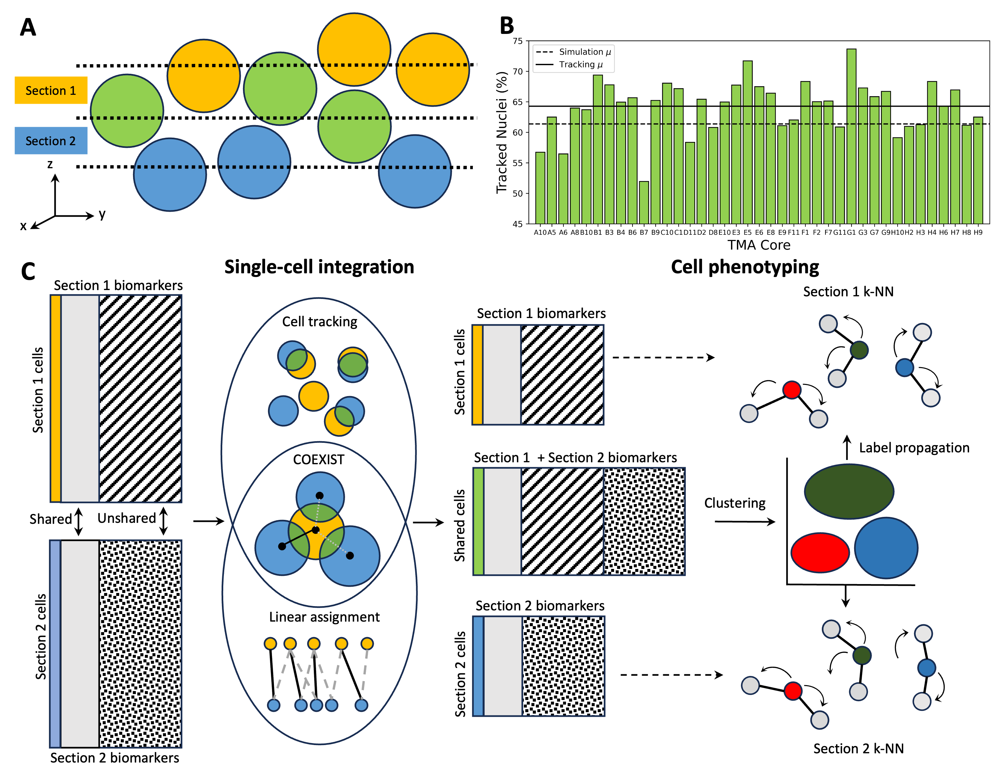

# Coexist: Coordinated single-cell integration of serial multiplexed tissue images

## Setup:
1. git clone https://github.com/heussner/coexist.git
2. conda create -n 'coexist' --file='environment.yml'
