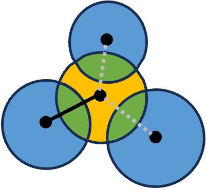

# COEXIST: Coordinated single-cell integration of serial multiplexed tissue images

## Setup
```
git clone https://github.com/heussner/coexist.git
conda create -n 'coexist' -python=3.8
conda activate coexist
pip install -r requirements.txt
```

## Usage
```examples/spatial_profiling.ipynb``` shows how to use COEXIST to spatially profile tissues.

```examples/cross_platform_comparison.ipynb``` shows how to use COEXIST to compare MTI platforms.

## Acknowledgements

## Citation
