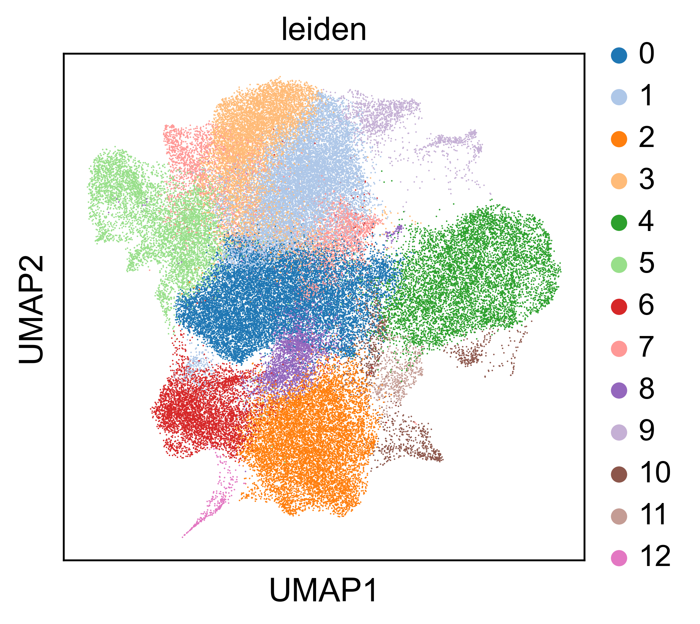
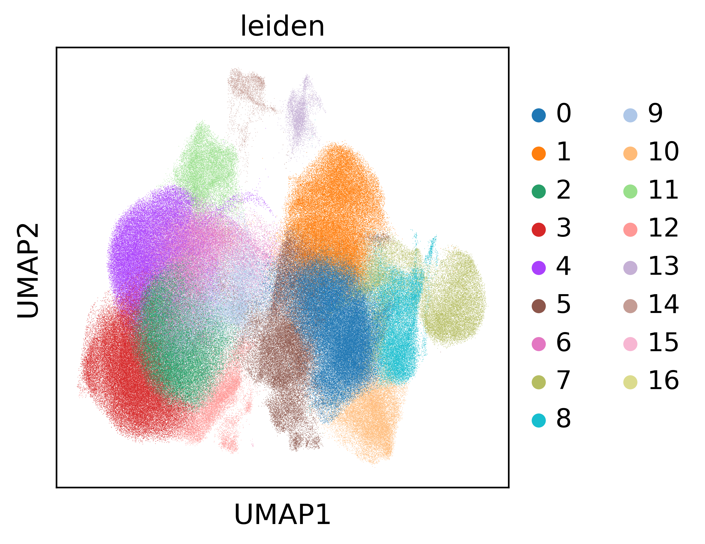

## Code and data for reproducing Figure 3

### Fig 3B & C Leiden clustering and UMAP plots

*Description*

Tonsil and CRC feature tables (available via HTAN portal and Synapse) Leiden clustering into ground-truth clusters for panel simulation

*Notebooks/scripts*

    1. Figure_3BC_umaps.ipynb

### Running the simulation

*Description*

Python script for performing the simulation. Run panel_simulation.py --help for params. See docstrings for more. Run on GPU with cuml implementation of KNN

*Notebooks/scripts*

    1. panel_simulation.py

### Fig 3B & C scatterplots

*Description*

Spatial scatterplots of ground-truth clusters in tonsil and CRC tissues

*Notebooks/scripts*

1. Figure_3BC_scatters.ipynb

### Fig 3D & E

*Description*

Evaluation metrics for panel simulation against ground truth clusters

*Notebooks/scripts*

- Figure_3D_3E.ipynb