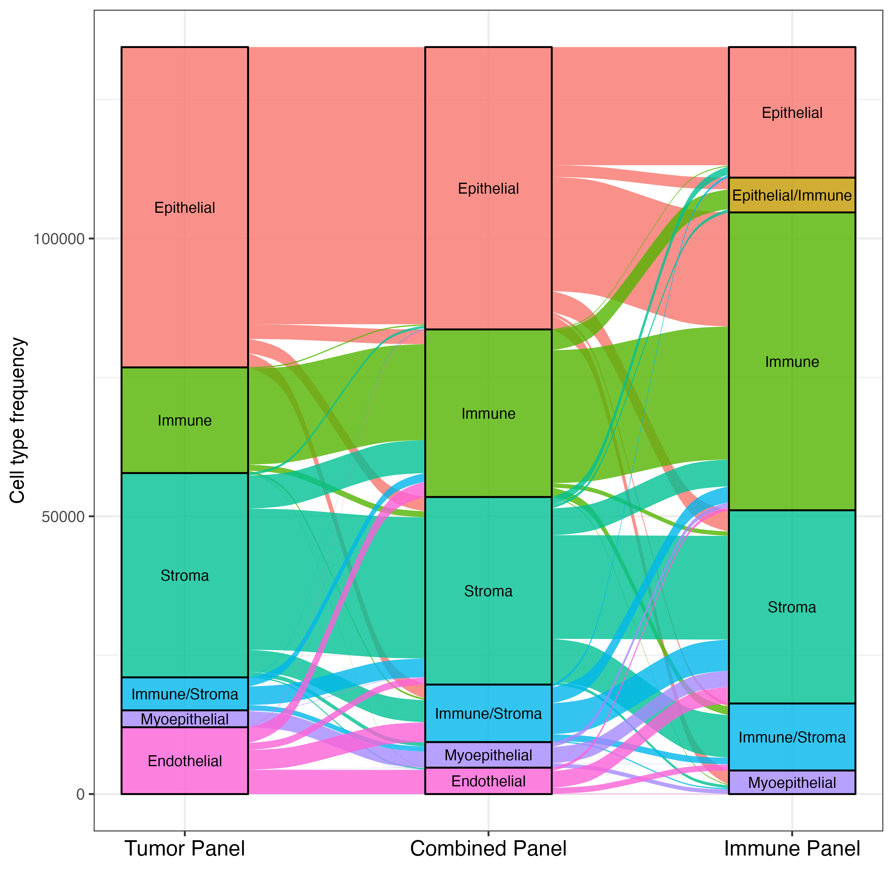
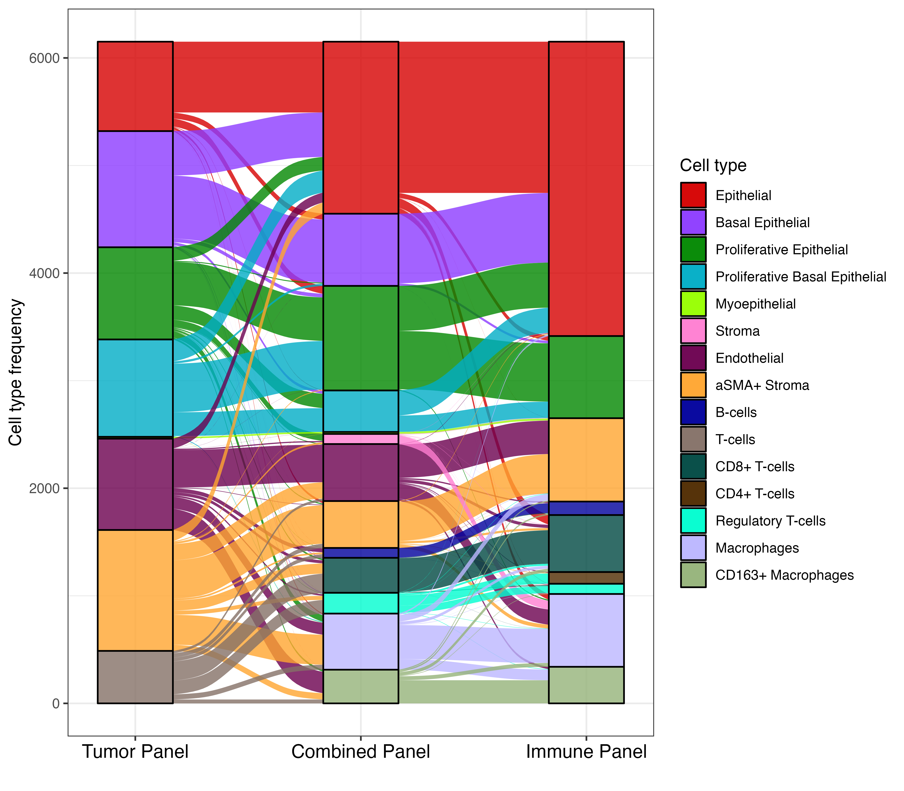
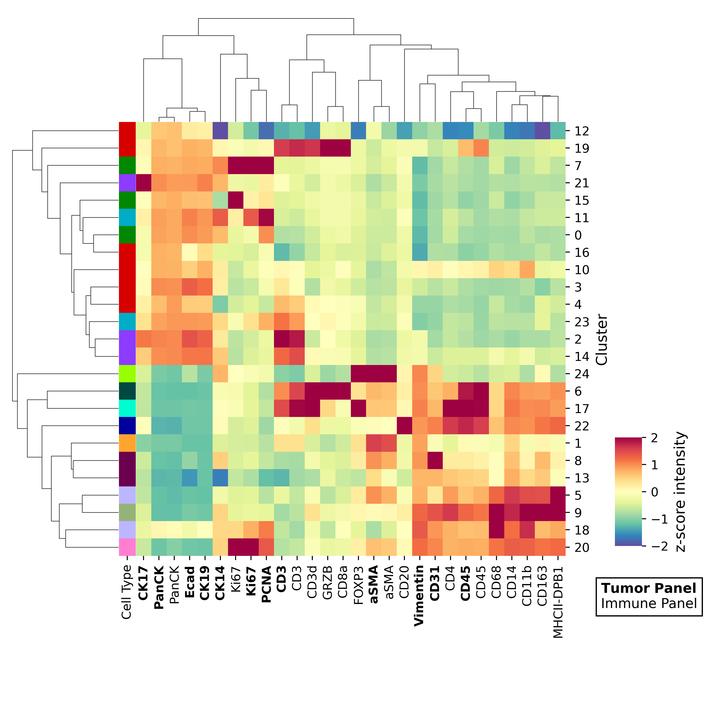
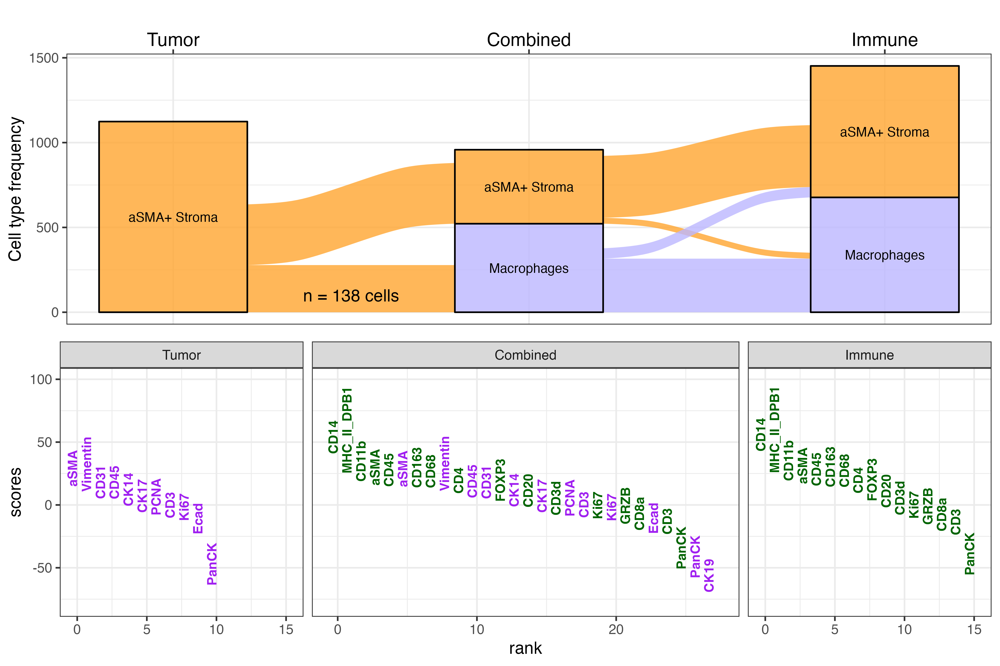
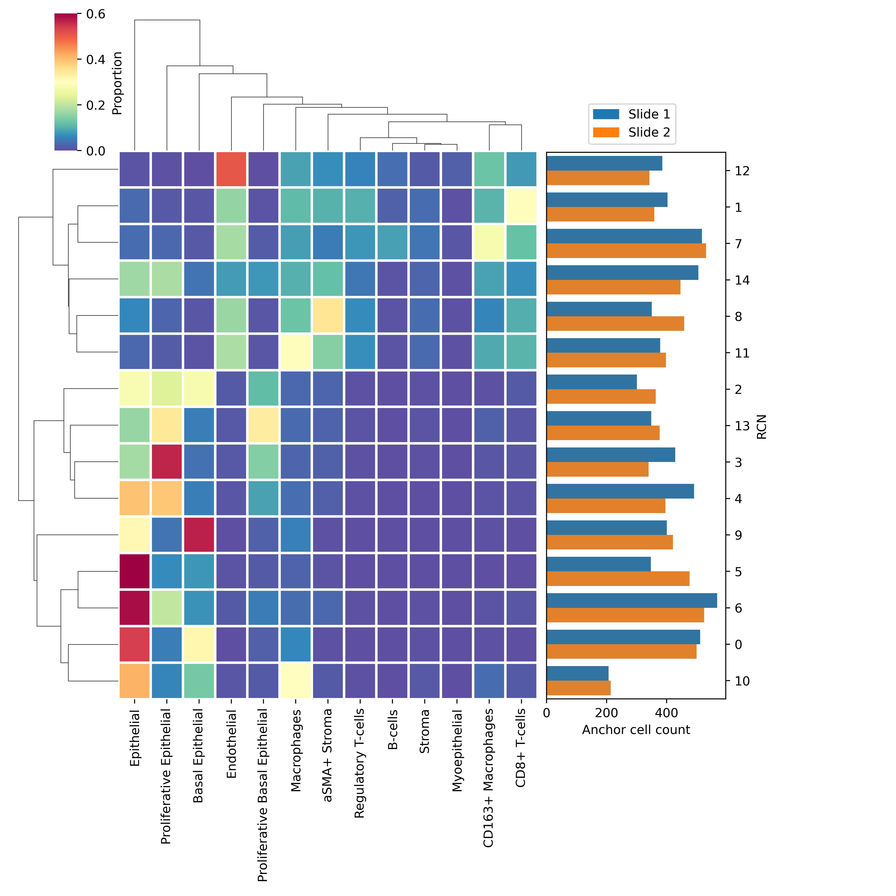
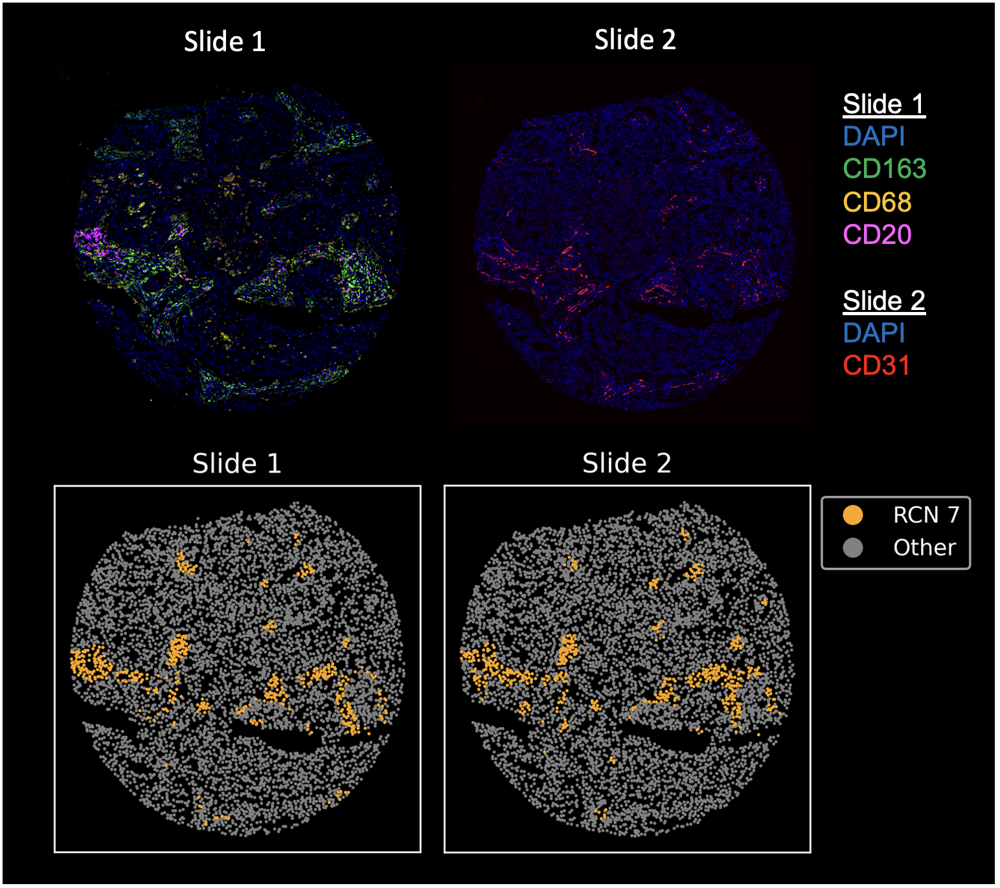

## Code and data for reproducing Figure 4

- All Jupyter notebooks were executed in `figures/4/envs/scanpy.yml`
- All R scripts were executed in `figures/4/envs/rviz.yml`

### Fig 4A

*Description*

Alluvial plot of broad cell types called on tracked cells from all breast cancer and normal breast cores in the tissue microarray 

*Notebooks/scripts*

    1. Figure_4A.R

### Fig 4B

*Description*

Alluvial plot of refined cell types called on tracked cells from core E06 

*Notebooks/scripts*

1. `notebooks/E06_leiden_clustering.ipynb`
2. `notebooks/E06_prep_alluvial.ipynb`  
3. `scripts/Figure_4B.R`

*Notes*

- Notebook 1 runs Leiden clustering (via Scanpy) on core E06 to generate refined cell type annotations. For clustering of more than one sample, it is recommended to use Grapheno clustering demonstrated in `examples/clustering_example.ipynb`
- Cell type annotations of Leiden clusters assigned in Notebook 1 are found under `figures/4/annotations` and are used throughout subsequent figures 
- Notebook 2 converts data files with Leiden cluster annotations (Example: `data/E06_immune_indiv_leiden.csv`) into a counts matrix that can be read into `ggalluvial` to create the figure 
- Script 3 takes the counts matrix and generates the alluvial diagram 

### Fig 4C

*Description*

Annotated heatmap of refined cell types called on tracked cells from core E06 

*Notebooks/scripts*

- `notebooks/Figure_4C.ipynb`

*Notes*
    
- Takes output of `notebooks/E06_leiden_clustering.ipynb` to create heatmap. For convenience, intermediate files are provided (Example: `data/E06_immune_indiv_leiden.csv`)

### Fig 4D

*Description*

Alluvial and ranked marker plot highlighting a subset of tracked cells that switched cell type identities between panels. 

*Notebooks/scripts*

- `notebooks/Figure_4D_prep.ipynb`
- `scripts/Figure_4D.R`

*Notes*

- The notebook prepares the data into the correct format for the R script to generate the plot

### Fig 4E

*Description*

Visual comparison of the cell phenotypes mapped to their spatial locations in the TNBC core adjacent sections (columns) before (top row) and after (bottom row) integrating them with COEXIST

*Notebooks/scripts*

- `notebooks/Figure_4E.ipynb`

*Notes*

- Here, cell labels were propagated to untracked cells on core E06 only. For larger scale propagations, see `propagate_labels()` function in `coexist/utilslib/utils.py` for a GPU implementation. 

### Fig 4F

*Description*

Recurrent neighborhood analysis heatmap showing cell composition per neighborhood and each neighborhood’s frequency in both sections.

*Notebooks/scripts*

- `notebooks/Figure_4F_4G.ipynb`

### Fig 4G

*Description*

Case study of RCN 7 from (C) showing image channels corresponding to RCN 7’s markers in both slides (top row) and the presence of RCN 7 after applying COEXIST (bottom row)

*Notebooks/scripts*

- `notebooks/Figure_4F_4G.ipynb`

*Notes*

Top half of Figure 4G is a visualization of the actual corresponding image data. 
